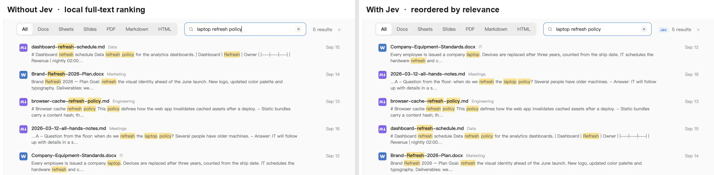
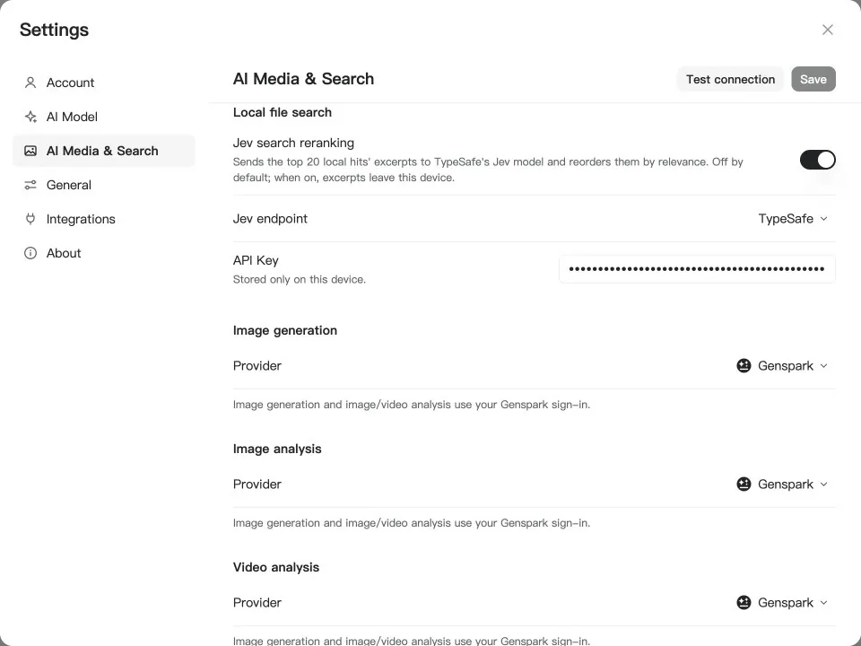

<p align="center">
  <a href="https://genoffice.ai/">
    <picture>
      <source srcset="docs/assets/readme/hero-dark.webp" media="(prefers-color-scheme: dark)">
      
    </picture>
  </a>
</p>

<h1 align="center">GenOffice · Word edition</h1>

<p align="center"><b>An open-source AI Word editor.</b><br>
<code>.docx</code> files, edited by you and your AI, saved back in the real format.</p>

<p align="center">
  <a href="LICENSE"></a>
  <a href="https://github.com/genspark-ai/genoffice/releases/latest"></a>
  <a href="https://github.com/genspark-ai/genoffice/releases"></a>
  <a href="https://github.com/genspark-ai/genoffice/stargazers"></a>
  <a href="https://x.com/merrickbuilds"></a>
</p>

<p align="center">
  <a href="#download"><b>Download</b></a> ·
  <a href="#command-line-and-agent-skill"><b>CLI</b></a> ·
  <a href="#mcp-server"><b>MCP</b></a> ·
  <a href="https://genoffice.ai/"><b>Website</b></a> ·
  <a href="https://genoffice.ai/join"><b>Community</b></a> ·
  <a href="https://x.com/merrickbuilds"><b>X</b></a> ·
  <a href="PRIVACY.md"><b>Privacy</b></a>
</p>

This is the **Word-only edition** of GenOffice (branch `lileapo-docx`): the
suite's Sheets, Slides, PDF, Markdown and HTML editors are removed, and what
remains is the Word editor, its home screen, the `genoffice` command line and
the MCP servers. Word parsing and saving can run on
[rsWordParser](https://github.com/LilLeapo/rsWordParser) (`rsWordParser/`,
enabled with `GENOFFICE_WORD_PARSER=rsword`).

- **Real `.docx`, byte-preserving.** Only what you edit is rewritten. Everything
  else in the file survives byte-for-byte, so documents keep working in Word.
- **AI you can review.** Edits land as tracked changes with one-click rollback
  of every AI turn.
- **Local by design.** Files open, edit, save and convert on your machine.
  PDF → Word and Markdown → Word run on-device. Only the AI calls leave the
  machine, to the provider you choose.
- **Find files by what they say.** The home screen searches the names,
  folders and full text of your `.docx` files from a local SQLite index, CJK
  included, optionally reranked by **[TypeSafe Jev](https://typesafe.ai/)**.
- **Your keys or none.** Sign in with Genspark and skip keys, or bring your own
  key for Claude, OpenAI, Gemini, DeepSeek and more, local servers included.
- **Scriptable and agent-ready.** A `genoffice` command line, an agent skill
  and an MCP server let Claude Code, Codex, Cursor and other agents create,
  convert, read and edit Word documents on your machine without opening a window.

## Demo

### 1 · Docs — open and edit `.docx` with an AI you can review

<table>
<tr>
<td width="50%"></td>
<td width="50%"></td>
</tr>
<tr>
<td><b>Opens the file as Word lays it out</b> — two-column sections, full-bleed images, shaded tables, headers and footers, pagination on Word's line metrics. Styles, comments, tracked changes, equations and ink round-trip untouched.</td>
<td><b>Ask for the edit</b> — the AI reads the blocks it needs, rewrites the Overview and inserts a new bulleted section. Every AI turn is a snapshot you can roll back; with <b>Track changes</b> on, edits arrive as Word-style revisions.</td>
</tr>
</table>

### 2 · PDF → Word, on-device

Open a `.pdf` and GenOffice converts it locally (PDFium character-level
extraction plus layout analysis, system OCR for scanned pages on macOS and
Windows) and opens the resulting `.docx` in the Word editor. Nothing is
uploaded.

### 3 · Search — find the file that answers the question, with TypeSafe Jev

Every file in your work folder is indexed on-device: names, folders and the
extracted text of Word files, in a
SQLite full-text index with CJK-aware tokenizing. Switch on **Jev search
reranking** and the top 20 local hits are judged by
[TypeSafe Jev](https://typesafe.ai/blog/introducing-system-one-models-and-jev),
the System One model that returns one calibrated relevance score per document
in a single call instead of generating text. The list is reordered by
that score; if the call fails or times out, the local order stays.


<table>
<tr>
<td width="50%"></td>
<td width="50%"></td>
</tr>
<tr>
<td><b>Same words, different answers</b> — "laptop refresh policy" matches a browser-cache refresh policy, a brand-refresh plan and a dashboard-refresh schedule word for word, so full-text ranking puts them first. Jev reads the excerpts and moves the equipment standards document, the one that states the three-year replacement cycle, to the top. The <b>Jev</b> badge next to the result count shows when the order came from the model.</td>
<td><b>Off by default, one switch to turn on</b> — Settings → AI Media & Search → Local file search. Pick OpenRouter or TypeSafe direct, paste a key, hit Test connection. Only when the switch is on do excerpts of the top hits leave the device; the index itself never does.</td>
</tr>
</table>

## Command line and agent skill

The `genoffice` command line does to a Word document from a terminal what the
editor does in a window: inspect, convert, create, read, edit, fill templates
and render, headless on the same engines. It installs with GenOffice, needs no
runtime of its own, and never sends a document anywhere. Paired with the
bundled **agent skill**, it turns a coding agent into a document worker that
produces real `.docx` files instead of Markdown approximations.

**Works with:** Claude Code, Codex, Cursor, Gemini CLI, GitHub Copilot,
OpenCode and Windsurf out of the box, any other agent that reads skills, and,
through the [MCP server](#mcp-server), Claude Desktop and every MCP client.

### Install the skill

Open **Settings → Integrations** in the app: it lists the agents found on this
computer and writes the skill into each one you choose (or download it as a
zip from the same page). Then start a new chat and ask for a document.

### Quickstart from the terminal

```bash
genoffice --version
genoffice info report.docx --json                  # headings and blocks
genoffice convert scan.pdf --to docx               # pdf → docx, md → docx/html, docx → md/html/pdf
genoffice create --type docx --from notes.md --out notes.docx
genoffice docs read report.docx --range 0-9 --json # then `docs apply --ops edits.json` edits in place
genoffice merge template.docx --data values.json --out filled.docx
genoffice render report.docx --out shots/          # one PNG per page, to look at what you made
genoffice open report.docx                         # hand the result to the editor
```

Every command prints a one-line summary, or a single JSON object with
`--json`. Edits are atomic: a rejected op leaves the file untouched and comes
back with a guided error. `genoffice help` lists the current command surface;
the full reference is [packages/cli/README.md](packages/cli/README.md).

### MCP server

The same commands are available as [Model Context Protocol](https://modelcontextprotocol.io)
tools, for assistants that cannot run a terminal. Copy-ready snippets are in
**Settings → Integrations → MCP**:

| Way                                   | What it is                                                                                                                                                                                                                                   |
| ------------------------------------- | -------------------------------------------------------------------------------------------------------------------------------------------------------------------------------------------------------------------------------------------- |
| **A · `genoffice mcp`** (recommended) | A stdio server the assistant starts itself; GenOffice does not need to be open. One tool per command (`info`, `convert`, `create_docx`, `create_pdf`, `docs_read` / `docs_apply` / `docs_check`, `merge`, `pdf_read`, `render`, `guide`, …). |
| **B · Local HTTP server**             | Runs inside the app on `http://127.0.0.1:3093/mcp`. Its tools drive a visible Word editor tab (`create_session`, `insert_content`, `replace_blocks`, `apply_ops`, `read_document`, `save_session`). Off by default.                          |
| **C · `genoffice mcp --http`**        | The stdio tool set as a Streamable HTTP server for clients on other machines; files travel with the calls (`PUT /files/<name>` uploads, results come back as download URLs). `--token` protects it.                                          |

```bash
# Claude Code
claude mcp add --transport stdio genoffice -- genoffice mcp
```

```jsonc
// Cursor, Claude Desktop or any other MCP client
{ "mcpServers": { "genoffice": { "command": "genoffice", "args": ["mcp"] } } }
```

## AI backends

**Sign in with Genspark** and there is nothing to configure: model calls route
through the Genspark proxy (Claude, GPT and Gemini families) and the agents get
web and image search, image generation, and image/audio/video analysis.

**Or bring your own key.** Settings → AI lists Claude, OpenAI, Gemini,
DeepSeek, Kimi, GLM, Qwen, Doubao, MiniMax, Grok, Mistral, OpenRouter, Requesty, Opper
and OpenCode Zen/Go, plus a custom slot for any OpenAI-compatible endpoint (base
URL + key), including local model servers. Search and media have their own
per-capability providers under **AI Media & Search**: Serper, Serply, Tavily or Parallel for
web search, and OpenAI, Gemini, Doubao/Seedream, GLM, Grok, Qwen, MiniMax or any
OpenAI-compatible images endpoint for image generation and image/video
analysis, plus DeepSeek V4.1 Flash for image analysis.

**TypeSafe Jev** reranks the home screen's file search. Under **AI Media & Search →
Local file search**, switch on Jev search reranking and pick an endpoint:
[OpenRouter](https://openrouter.ai/typesafe) (model `typesafe/jev-1.13`) or
TypeSafe's own API. The key is stored only on this device. It is off by
default; when on, the excerpts of the top 20 local hits are sent for judgment
and nothing else leaves the machine.

**Parallel** works without an account: its free Search MCP (rate-limited) is the
default web search whenever no Genspark login or search key is configured, and
it runs ahead of the DuckDuckGo scrape. Select Parallel under Web search and
enter a [Parallel](https://platform.parallel.ai/) key to use the Search API
instead.

The app ships light, dark and system themes. Themes only change what
is on screen: exports, prints and saved files always keep the document's own
colors.

## Download

Every version of `apps/shell/package.json` is built by
[`.github/workflows/release.yml`](.github/workflows/release.yml) and published
as release `v<version>` on the [Releases](../../releases) page, one plain file
per platform:

| Platform                | File                                       | How to run                                                      |
| ----------------------- | ------------------------------------------ | --------------------------------------------------------------- |
| **Windows** x64         | `GenOffice-Word-<v>-windows-x64.exe`       | Portable, no installer: double-click                            |
| **Linux** x86_64        | `GenOffice-Word-<v>-linux-x86_64.AppImage` | `chmod +x` and run (needs FUSE 2, e.g. `libfuse2`)              |
| **macOS** Apple Silicon | `GenOffice-Word-<v>-macos-arm64.dmg`       | Ad-hoc signed, not notarized: right-click → Open the first time |

## How it works

Two Electron modules — the Word editor (Docs) and the tabbed shell — share one
engine layer of pure TypeScript packages. The original file is always the
source of truth: edits are applied as narrow patches, and everything the editor
did not touch survives the round trip untouched.

```
open docx ─► archive original by hash (never touched)
          ─► parse word/document.xml into a block tree, each block anchored to its original XML
          ─► Tiptap editor (manual + AI editing, dirty tracking)
save      ─► dirty blocks → OOXML fragments (referencing existing styles only)
          ─► splice into the original document.xml; untouched blocks keep their bytes
          ─► repack the zip; every other entry is copied byte-for-byte
```

The package-by-package tour lives in [CONTRIBUTING.md](CONTRIBUTING.md#engine-packages).

## Development

```bash
npm install
npm run fixtures     # generate test .docx fixtures
npm test             # engine + app unit tests
npm run typecheck    # tsc --noEmit across every workspace
npm run dev          # the Word editor + shell against a Vite dev server
npm run dev:docs     # the Word editor alone
npm run dist:mac     # package macOS dmg (regenerates third-party notices)
npm run dist:win     # package Windows nsis installer
npm run dist:linux   # package Linux AppImage + deb + rpm
```

See [CONTRIBUTING.md](CONTRIBUTING.md) for the checks every change must pass.

## Community

GenOffice is in active development and your feedback shapes it.

- **Report a bug or request a feature** in
  [GitHub Issues](https://github.com/genspark-ai/genoffice/issues).
- **Join the GenOffice group chat** on
  [GenTeam](https://genoffice.ai/join) to talk to the team and other users.
- **Follow [@merrickbuilds](https://x.com/merrickbuilds) on X** for release
  notes, demos and what is being built next.
- **Star the repo** if GenOffice is useful to you — it is the best way to
  support the project.

## FAQ

<details>
<summary><b>Is GenOffice free?</b></summary>

Yes. GenOffice is free and open-source under the Apache-2.0 license — no
trial, no paid tier for the apps themselves.

</details>

<details>
<summary><b>Can GenOffice open Microsoft Word files?</b></summary>

Yes. GenOffice opens and saves native `.docx` files.
Saving is byte-preserving: parts of the file you didn't touch are written
back byte-for-byte, so documents keep working in Microsoft Word.

</details>

<details>
<summary><b>Does GenOffice work offline?</b></summary>

Document editing is fully local — files never leave your machine to be
opened, edited, saved or converted. The AI features (agents, search, image
tools) need a network connection, with either a Genspark sign-in or your own
model API key.

</details>

<details>
<summary><b>Can GenOffice convert PDF to Word?</b></summary>

Yes — entirely on-device: PDFium character-level extraction plus
geometry-based layout analysis, no cloud service, no upload. Scanned pages
are covered too: on macOS and Windows the system OCR reads them, so they
convert to editable text rather than a page image.

</details>

<details>
<summary><b>Can I use my own AI model or API key?</b></summary>

Yes. Besides the keyless Genspark sign-in, GenOffice supports bring your own
key for Claude, OpenAI, Gemini, DeepSeek, Kimi, GLM, Qwen, Doubao, MiniMax,
Grok, Mistral, OpenRouter, Requesty, Opper and OpenCode Zen/Go, plus any OpenAI-compatible
endpoint — including local model servers. Search, image generation and
image/video analysis take their own keys under Settings → AI Media & Search.

</details>

<details>
<summary><b>Can I drive GenOffice from Claude Code, Codex, Cursor or a script?</b></summary>

Yes. GenOffice installs a `genoffice` command line that runs the same engines
headless: inspect, convert, create, read and edit documents from a terminal or
a script, with `--json` output for programs. The bundled agent skill teaches
Claude Code, Codex, Cursor, Gemini CLI, GitHub Copilot, OpenCode and Windsurf
to use it; install it from **Settings → Integrations**. See
[Command line and agent skill](#command-line-and-agent-skill).

</details>

<details>
<summary><b>Does GenOffice collect any data?</b></summary>

Official packaged builds send limited usage analytics by default, and you can
disable reporting at any time under Settings → General. Analytics never sends
document content, file names, file paths, account identity or email
addresses. See [GenOffice Privacy](PRIVACY.md) for the complete event and
data disclosures.

</details>

## Security

See [SECURITY.md](SECURITY.md) for the process security posture (renderer
sandboxing, IPC validation, external-link gating) and the threat models for
AI-generated content.

## Acknowledgements

GenOffice would not be possible without these open-source projects:

- [Electron](https://www.electronjs.org/) — the desktop runtime.
- [PDFium](https://pdfium.googlesource.com/pdfium/) (BSD-3-Clause, bundled via
  [@embedpdf/pdfium](https://github.com/embedpdf/embed-pdf-viewer)) — the
  PDF engine behind the on-device PDF → Word import.
- [pdf.js](https://github.com/mozilla/pdf.js) (Apache-2.0) and
  [pdf-lib](https://github.com/Hopding/pdf-lib) (MIT) — PDF rendering and
  document assembly.
- [Tiptap](https://tiptap.dev/) / [ProseMirror](https://prosemirror.net/) —
  the Word editor.
- [HarfBuzz](https://github.com/harfbuzz/harfbuzz) (wasm) — text-shaping
  metrics for complex scripts.
- [React](https://react.dev/) (MIT) — the UI layer.
- [Mermaid](https://mermaid.js.org/) (MIT) and [KaTeX](https://katex.org/)
  (MIT) — diagrams and math.
- [opentype.js](https://opentype.js.org/) (MIT) — font parsing for metrics
  and glyph lookup.
- [JSZip](https://stuk.github.io/jszip/) (MIT) and
  [fast-xml-parser](https://github.com/NaturalIntelligence/fast-xml-parser)
  (MIT) — the OOXML container and XML layers.
- [Fluent UI System Icons](https://github.com/microsoft/fluentui-system-icons)
  (MIT) — the icon set across the ribbons.
- [electron-updater](https://www.electron.build/) (MIT) — in-app updates.
- Liberation, Carlito, Caladea, and Noto CJK fonts (OFL/Apache-2.0) — bundled
  document fonts.

`npm run notices` regenerates the bundled third-party license summary
(`tools/gen-third-party-notices.mjs`); all runtime dependencies are
MIT/Apache-2.0/BSD-3-Clause/OFL.

## License

GenOffice is licensed under the [Apache License 2.0](LICENSE), with one
exception: the `ee/` directory is reserved for future enterprise modules and
is covered by the [GenOffice Enterprise License](ee/LICENSE).

The GenOffice and Genspark names and logos are trademarks of Mainfunc, Inc.
The Apache-2.0 license does not grant permission to use them (see section 6);
forks should use their own branding.
